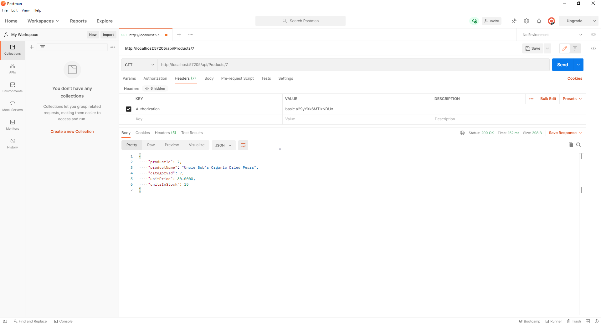
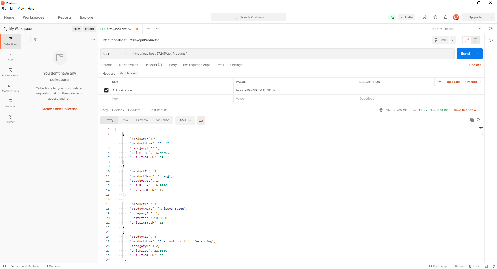
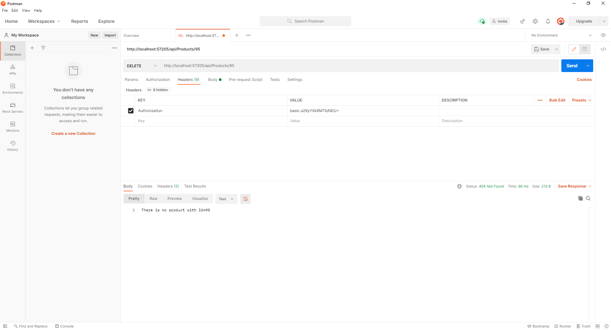
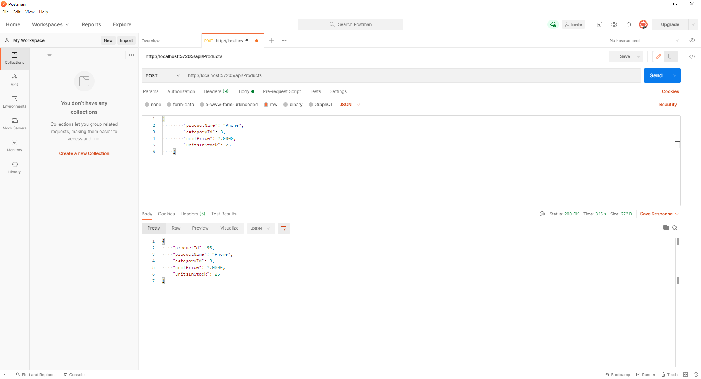

# Basic Overview
This sample web api contains a product controller and you can `GET/POST/PUT` and `DELETE` product items. Also, you must authenticate the user to get data or to do which methods you want to use.
## Get single product
`http://localhost:57205/api/Products/7`

 

## Get all products
`http://localhost:57205/api/Products`



## Delete a product
`http://localhost:57205/api/Products/95`



## Post a product
`http://localhost:57205/api/Products`


  ```
  { 
     "productName": "Phone",
     "categoryId": 3,
     "unitPrice": 7.0000,
     "unitsInStock": 25
  }
  ```



 
